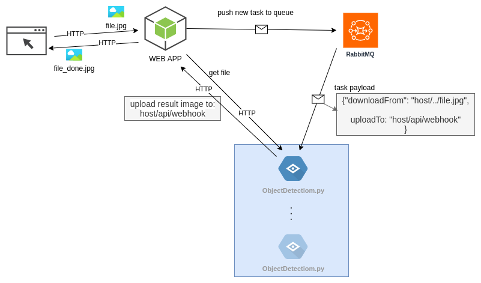
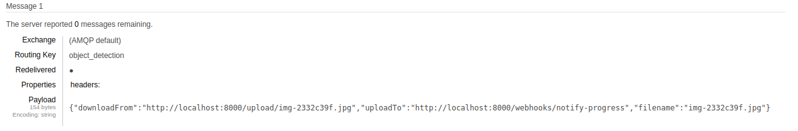

<figure class="ui image centered">
	
  <figcaption class="ui centered label"><a class="nonprintable" href='https://www.freepik.com/vectors/man'>Man vector created by vectorjuice - www.freepik.com</a></figcaption>
</figure>

## The Right Tool

I believe that a key to understand any technology is to first understand the kind of problems that it's trying to solve. I've been reading about message queues and how they are being used in asynchronous communication between services. However I really didn't find many interesting practical examples using such architecture so I made this one.

Now imagine this scenario: we are required to build an objects detection web service. Users will upload images for processing and will get the result back. The problem is that image processing is really CPU intensive task, If we are going to implement this as a simple monolithic HTTP service the client will have to wait for - well almost a minute if the server was my Core-i3 PC - before getting the response and it's not really a desirable behavior to have a response time of several minutes, so we want to reply back quickly and carry processing in background and then notify our user that her image is ready.

This is what we are going to build

One solution you might think of is: we would accept user request, spawn a thread for processing the image in he background and immediately response back to user, then when the image-processing thread is done you might notify the user by firing some sort of web-socket event or requiring the user to periodically pull result . While this architecture is better than the former simpler one, however it does not scale very much, specially if I told you that the image processing thread takes up to 1.2 GB RAM and eventually you will have to scale horizontally.
This is where message queuing comes in handy. Assuming you already done some reading on message queues and message brokers. I'll explain how we gonna use asynchronous services communication to solve this problem.

In this architecture we have the following services and their corresponding responsibilities:

- The Web App:

  This is a simple HTTP API that deals with clients and accepts images uploads, store the images to disk, and push a new task to the broker.

- The broker:

  This is our mean of communication between our HTTP server and the worker(s). It queues message and forward them to available workers.

- The worker:

  This service -or this program- will do the heavy stuff, when a new message arrives from the broker, a worker will first get the image process it then upload the modified image back to the server so the users can get it.

## Data flow
When a user uploads an image to the server, it'll push a message (task) to the broker. The broker will push this updates to all connected workers. Any time that a worker is free will receive the message, the message will contain relevant details about how to get the image and where to output the result, but these are just details, what we are really concerned about here is that our HTTP server is free as soon as the image is uploaded. Plus we can have as many workers as required. You can start with one worker on the same machine with the server and scale horizontally as you want as long as you can connect your new workers to the broker.

## The code:
First It's **mandatory** to read [RabbitMQ documentaion](https://www.rabbitmq.com/documentation.html) frist, to get their [terminology](https://www.cloudamqp.com/blog/RabbitMQ-and-AMQP-concepts-glossary.html) and understand the code.

[Here this project repo](https://www.github.com/3omer/myeye), you can run the whole thing with docker-compose.

The server is build with Express.js, and the wroker is written in Python, I mean .. . common! I know there is probably a Node.js package for objects detection but I'm sure Python will be more convenient to use plus this will emphasize the fact that how REALLY decoupled services are that it does not matter what programming language you are using.

### Quick walkthrough

The [`server/rClient.js`](https://github.com/3omer/myeye/blob/master/server/rClient.js) module is responsible for dealing with the broker. I'm using the official client `amqplib` as explained in [RabbitMQ Client Docs](https://www.rabbitmq.com/tutorials/tutorial-one-javascript.html). I'm using the function `getChannel` to maintain a single connection object.

The function `queueImage` push a new message to the broker when a user upload an image.

Here is a message with it's payload

Notice in the payload we have the parameter `downloadFrom` and it's just the image URL, this is how the worker will get the image that the user just uploaded. Also in payload we have `uploadTo` and it's an HTTP API as you guess it the worker will POST results to.

Our HTTP APIs are simple, one for user to upload images, see in [`server/routes/reports.js`](https://github.com/3omer/myeye/blob/master/server/routes/reports.js#L22-L42) , the route `/api/request` accepts uploading images and then call `queueImage` as I explained above to push a new task to the broker, notice the parameter `uploadTo` is always equal to `api/webhook` as we are using the route to accept result images from workers too. The parameter `resultURL` is where the final processed-image will be. The client will call this URL to check weather or not their result is ready.

### The worker code

Don't worry you don't have to be an AI enthusiast to get this, I'm certainly not a one. I used this package [ImageAI](https://github.com/OlafenwaMoses/ImageAI) for objects detection, [here is the example we are using](https://github.com/OlafenwaMoses/ImageAI/blob/master/imageai/Detection/README.md).

The worker starts by connecting to the RabbitMQ broker 'duh!', then we subscribe to the queue and set the callback function that will be executed every time the worker receives a task.
The callback function [`on_message`](https://github.com/3omer/myeye/blob/master/worker/main.py#L44-L67) will parse the JSON payload to get the image meta data -remember? the download and upload url- then it uses these parameter to download the image process it and upload it back and finally if everything goes well acknowledge back to the broker that this task is done and the worker is free to get the next task.
