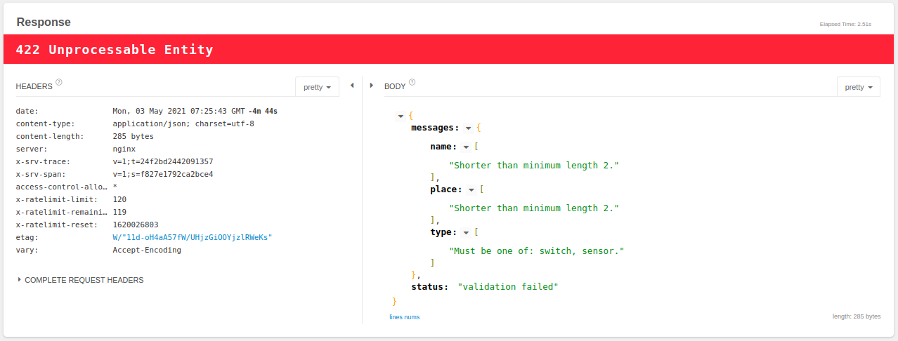

<figure class="ui image centered">
	
</figure>

## Data Validation

When building API that accepts inputs you always have to check weather the data adheres to the specification of what you consider a valid usefull data.

> I'll assume you already know the very basics of building API's. The code snippets are written in Javascript, but they are pretty simple.

For example if you have the endpoint `/register` that accepts `POST` requests to register new users, and you expect -or you explicitly documented :) - that the request's body should contain the properties:

- `username` string of with at least 3 characters, only letters and numbers.

- `email` string, a valid email.

- `password`: string, 8 characters length.

And you implemented the _very_ optimistic handler :

```js
//* user.controller.js *//

// register new user
router.post('/api/users', async (req, res, next) => {
  const data = req.body
  const user = new User(data)
  try {
    await user.save()
    return res.status(201).json({ user })
  } catch (error) {
    return next(error)
  }
})
```

Very simple and seems logically right but .. . Why is it bad? glad you asked. Unfortunately one of your clients submitted a form with the fields

```javascript
{ "username": "~*~AnaTootaCool~*~", "email": "", "password": "0000" }
```

with no email, luckily? you have a constraint on the database model that the field `email` is required, so the server returned a `500 Internal Error` and you also realized your app had been accepting a lot of invalid data all the time, now your boss is very mad at you but you blamed the frontend developer because he didn't even bother to read your neatly written docs :( .. and now he lost his job, but don't worry about him their market is hot. Just kidding :). Seriously speaking who is to blame on this? Well actually both!. it's a "full stack" mistake, validation is required on both side [[1]](#validation).

OK, now you are tasked to implement the validation logic. While it seems very simple task and you are already thinking you can just add lines of `if else` statements before you create the user, but that doesn't scale very well when you have more and much complicated parameters plus you should not waste your time inventing the wheel and introducing even more bugs, we just gonna use `express-validator` package that not only has plenty of validators for most use cases but it also helps you to keep consistent validation errors response format across all endpoints. I bet the frontend dev is gonna be very impressed by your good API designing skills if he get his job back :)

Now refer to [this](https://express-validator.github.io/docs/index.html#installation) for the `express-validator` installation and read the basic guide example which is surprisingly similar to your task ( and this is gonna be the situation for _most_ of your problems, they are already solved or someone made them a lot easier :) )

So your validation code should now looks like this

```javascript
/* user.conroller.js */
const { body, validationResult } = require('express-validator')

/**
* when using body() fetch the key from the request body .. duh!
*/

const emailValidator = body('email')
  .isEmail()
  .withMessage('you must enter a valid email') // this define the error message

const passwordValidor = body('password')
  .isLength({ min: 8 })
  .withMessage('must be at least 8 characters')

const usernameValidator = body('username')
  .isString()
  .isAlphanumeric()
  .withMessage('only letters and digits are allowed')
  .isLength({ min: 3 })
  .withMessage('must be at least 3 characters'),

// group them
const newUserValidator = [
  usernameValidator
  emailValidator,
  passwordValidor,
]


// register new user
// notice we've added the middleware, if you are not familiar with Node, a middleware is executed just before the route
router.post('/api/users', newUserValidator, async (req, res, next) => {
// check for validation errors
  const vErrors = validationResult(req)
  if (!vErrors.isEmpty()) return res.status(422).json({ errors: vErrors.array() })
  const data = req.body
  //  don't forget to check if the email is already used
  const user = new User(data)
  try {
    await user.save()
    return res.status(201).json({ user })
  } catch (error) {
    return next(error)
  }
})

```

In case you are wondering why the status code is `422` not `400`, well there is a debate that the status code for validation errors is `422 Unprocessable Entity` and some argue that the correct code is `400 Bad Request` [[2]](#400vs422) ,`422` sounds more accurate to me.
Let's see now how the server will response to the NOT cool at all client who made all this trouble.

```js
HTTP/1.1 422 Unprocessable Entity

{
    "errors": [
        {
            "value": "~*AnaTootaCool*~",
            "msg": "only letters and digits are allowed",
            "param": "username",
            "location": "body"
        },
        {
            "msg": "you must enter a valid email",
            "param": "email",
            "location": "body"
        },
        {
            "value": "0000",
            "msg": "must be at least 8 characters",
            "param": "password",
            "location": "body"
        }
    ]
}
```

Remember, NEVER trust user input, ALWAYS validate before you use. Your clients are going to suprise you by the kind of data they submit, and you know who else? HACKERS.
Refer to [OWASP cheay cheat series](https://cheatsheetseries.owasp.org/cheatsheets/Input_Validation_Cheat_Sheet.html) for more reading on the subject and specially the security concerns.

<a name="validation"></a>[Should a backend Restful API implement data validation
](https://softwareengineering.stackexchange.com/questions/341913/should-a-backend-restful-api-implement-data-validation)

<a name="400vs422"></a>[400 vs 422 response to post of data](https://stackoverflow.com/questions/16133923/400-vs-422-response-to-post-of-data)
