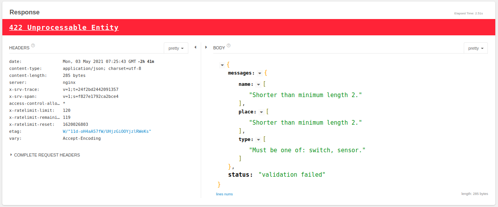

<figure class="ui image centered">
	
</figure>

I was adding email-confiramation feature to aside project I'm working on. The REST-API is bulit by Flask, and you know Python is really not good at handling IO operations (not talinkg about the new ASYNC framewroks) so I thought let's test how many user the regesrtaion API can handle in on minute if we sent the email syncronosly in the main thread and if I sent them asyncronously in background thread.

Testing by Jmeter:
I genarally used `appache-benchmark` to load test endpoints but in this case I have to generate dynamic payloads with different email and username every request and apache not really suitable for that, I googled around and I found this tool called (`Jmeter`)[].

## Jmeter configuration

`number of threads` and `ramp-up period` determine how many conccurent requests Jmeter is going to fore. For example 1000 users in 10 seconds means Jmeter will initiate 100 requests every seconds.
I fixed the ramp-up period on 60 seconds and ran the test with 750, 800 and 850 requests. In each test I generated a response-time graph because I think it's more interesting than just comparing the average reponse-time.

## Results

- 750 request distributed over one minute:

  > Gunicorn server is started with 16 gevent workers

  

  **average respone time (BLOCKING) = 443ms**
  **Average response time (ASYNC) = 307ms**

  There are almost close. The average response time when the server is sending the emails synchronsuly is 443ms. And 307ms for the non blocking implementaion.
  I thought 16 workers is the best I can get on my 4 CPU's but I tested with 20 workers and the response time was 278 ms (I tested the non-blocking), so all next tests I'm going to use 20 workers for better performance.

- 800 request

  > Gunicorn server with 20 gevent workers

   

  **Average respone time (BLOCKING) = 790ms**
  **Average response time (ASYNC) = 662ms**
  **Average response time (without sending emails) = 294ms**

  To be honest I was very disapointed by this result, I thought the async version will _almost_ eliminate the latency introduced by the email-sending feature.
  Even though I scaled the web server to use 20 workers, then 30 workers but it got worse so 20 is the best we can get.

  OK, let's try 850 request to see if it's going to crash

- 850 request
  

  **Average response time (ASYNC) = 2026ms**
  **Average response time (NO-MAILs) = 537ms**

  Almost only 3 seconds for the blocking version and the respose time took a more vertical shape. The server started to queue up requests so I didn't wait it to finish all the 850. Even the async version is not performing well the response time is going to surpass the 5s if the test had ran longer. Appearently sending emails asynchronusly is not helping to increase server throughput at all.

I think I'm getting close results because the email sending is really a blocking operation when your are using a local STMP server like the one I used for this test, I guess handling emails in background threads will have a great impact if you are using a remote SMTP or API for instance. To memick this network delay, I decided to add 500ms delay in the email-sending function , which should make the defference between the threaded and blocking version more obviuos.
OK let's expolre how the response time will react to the introduced delay.

## Network Delay effect

- At 750 request
  I didn't finish the test. After 400 request sent I noticed the number of queued requests had gotten over 100 ! and the response time is now 1863ms comparing to 443ms when there was no delay ! .. Why? because there are no free workers to accept more requests, All the 20 workers are forced to wait 500ms for the mail server to respode. So threads really worth the effort !
  

## One last thing

What about the 1000 requests? well unfortunately with threads and with no threads the server couldn't handle 1000 requests in a reasonable time, 1000 requests over 60 seconds means the server should has ~17 rps throughput at least but Flask couldn't make more than 13 rps, I think the bottleneck now between Flask and mongodb, I'm using the ODM `mongoengine` but propably it's just becasue Flask is not an ASYNC framework. Anyways I made one final test with Node.js/Express and mongoose, I have the same endpoint (it register a user and sends an email) and I load tested it with 1000 requests over 60 seconds .. . and it seaminglessly handled it like it's nothing .. and scored only **73 ms** average response time .. amazingly fast.

  
