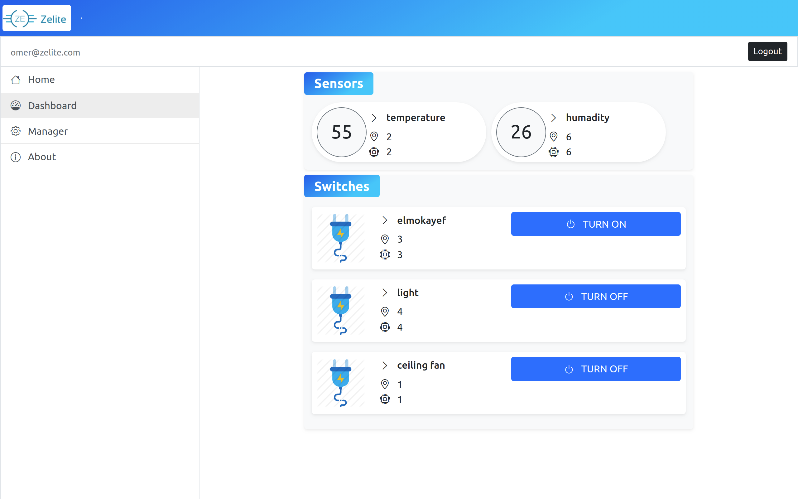
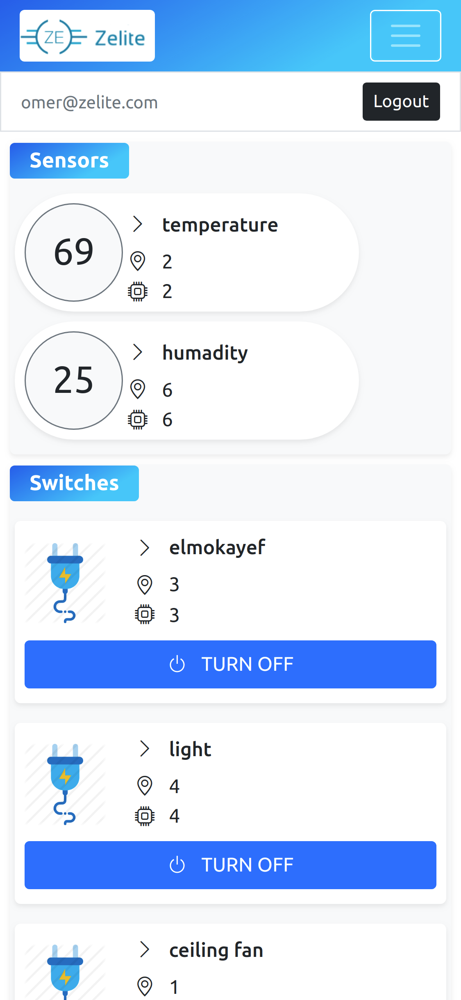
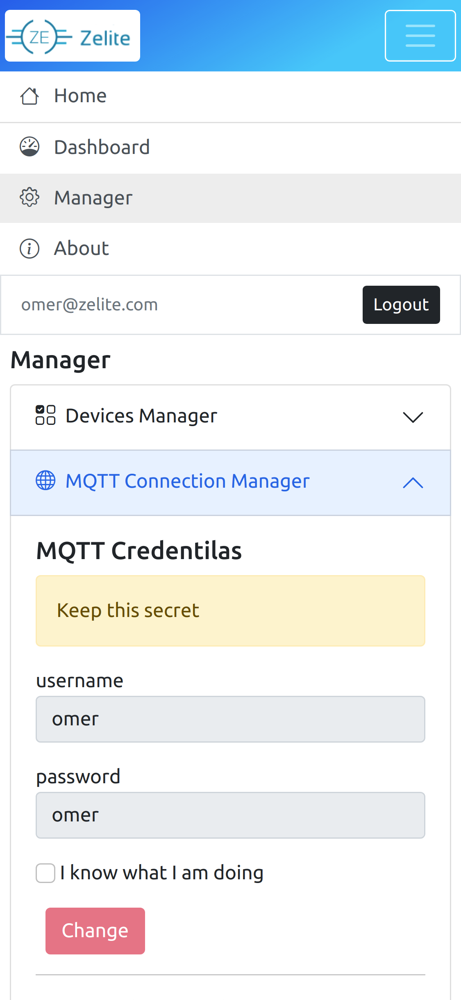

Zelite is an IoT platform to monitor and manage home devices "Lights, Fans, TV ..etc". Basically you can control any device by connecting it to a relay that has an internet connection. It's composed of a REST API for AuthN/AuthZ and devices management. The actual messaging between end devices "IoT" and the front end is done through MQTT broker.

[Live Demo](https://3omer.github.io/zelite-client/)

The REST API is built with flask. In the first version the whole project lived togther, I used templating language to build the front end and cookies's based authentication. Eventually I separated the front end and used JWT for authentication.

While I could have used HTTP to connect IoT devices too -which I did at early stages- but it has many draw backs: First it's bad for scalling, imagine hundered of IoT devices hitting the API every 3-5 seconds to get real time updates. Plus HTTP and JSON parsing is heavy and inconvienet at these IoT devices anyway. Thats why I opted for the light-weight MQTT portocol. Since MQTT can persists last mesaages we don't needto bother the database with IoT traffic 'huge plus for scalability', and MQTT has client liberaries for most languages throw WebSockets.

The Client App is an SPA build with Vue.js.

Screens:

  
  
  

