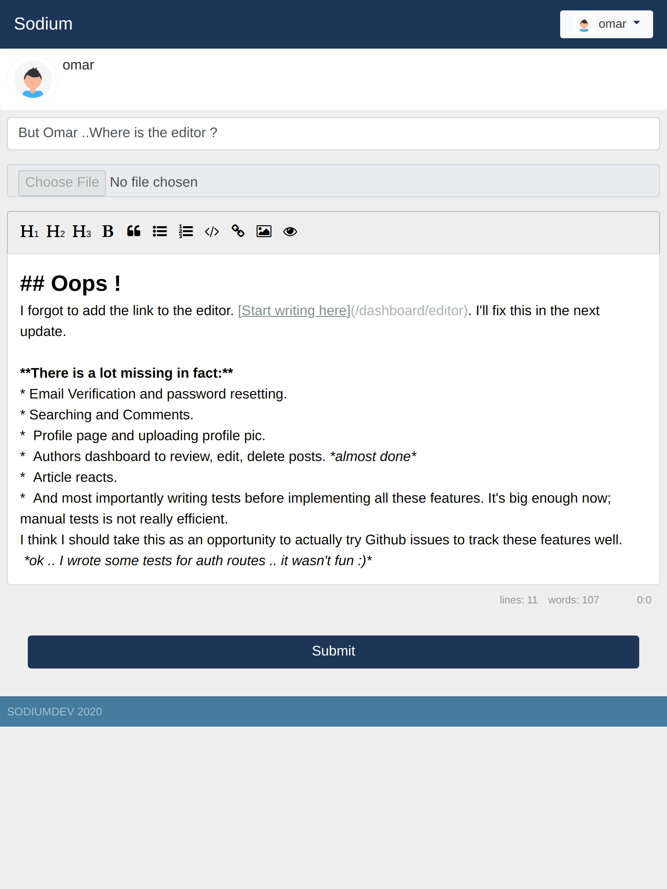
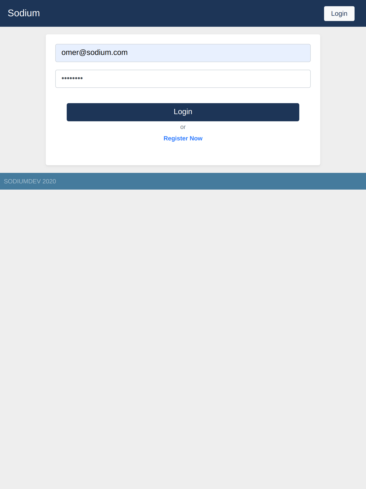
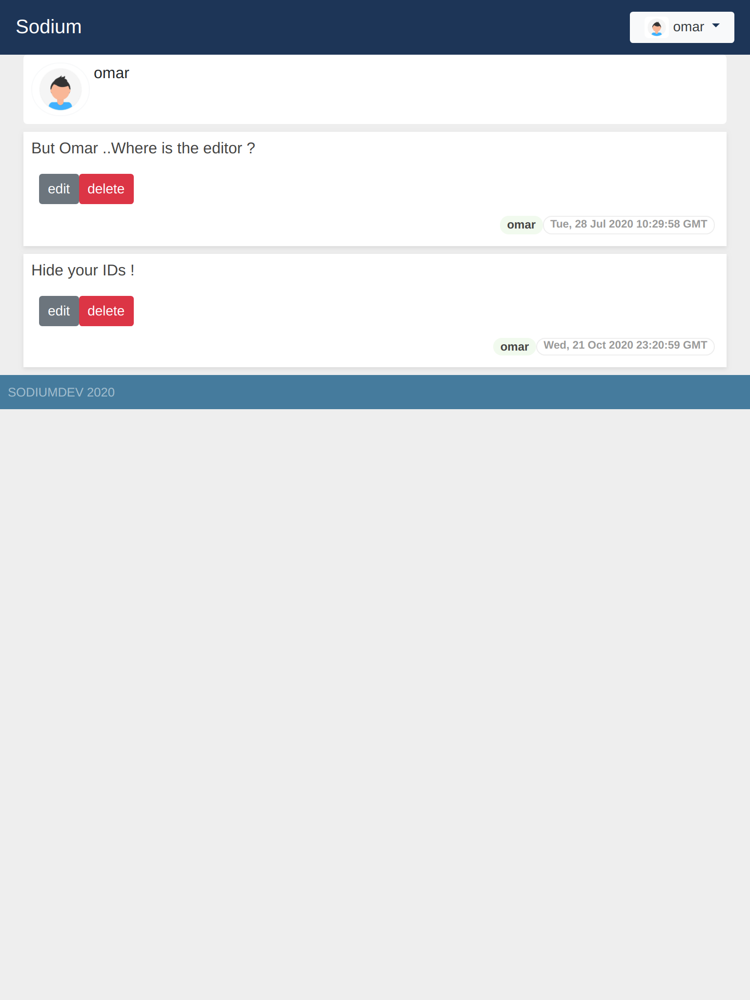
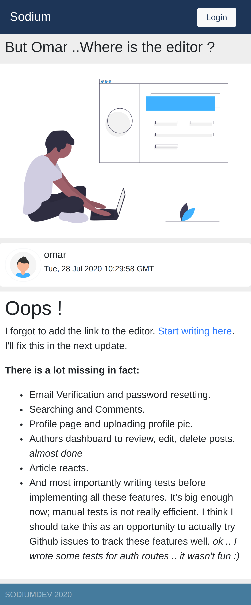

Sodiumdev is a complete multi-user blogging engine I build when I started learning **Node.js**.

> [Live Demo](https://sodiumdev.herokuapp.com/)

> Source: <a href="https://github.com/3omer/sodiumdev"><i class="large github icon"></i>Sodiumdev</a>

## Technologies and Tools:
- **Passport.js** to implements **cookies** based authentication/autherization using **Redis** as **sessions** store.
- Mongoose ODM.
- [EasyMDE](https://github.com/Ionaru/easy-markdown-editor) Markdown eidtor with instant preview.
- Responsive UI with **Bootstrap**.
- **Redis** for caching.

## Screens:

  
  
  
  

