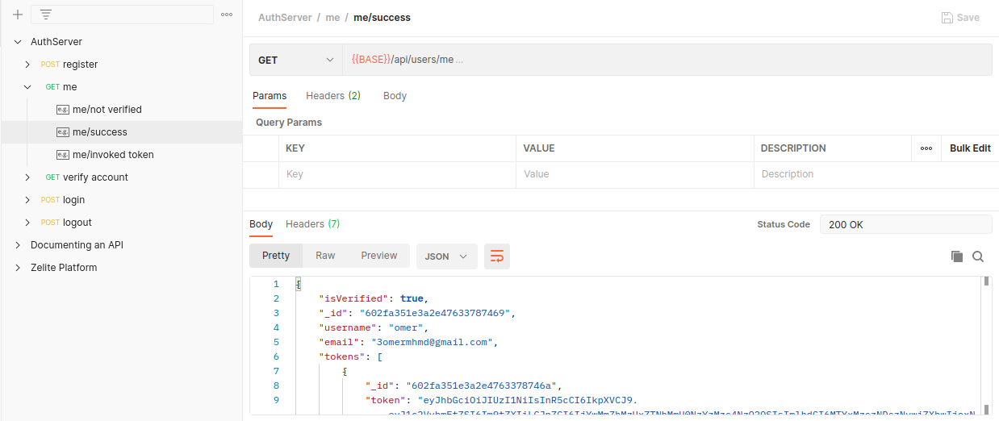

This service is implemented as a **REST-API** for users authentication. It depends on **JWT** for managing the authentication.

Features:
- Email verfication:
    I used **Nodemailer** and **JWT** to implement this feature. Upon signing up users get an email with a verfication link. The verification link contains a token as a parameter. The endpoint verifiy the token and activate the account.

I learnt about testing too while implementing this service. I've used **Jest** for the testing part.
I've written the API specfication using **Postman**.

Features that will be introduced soon:
- Roles
- Password reset
- Caching recent active users with Redis to enhance performance.
- Dashboard for Admins.

> Source: <a href="https://github.com/3omer/authServer"><i class="large github icon"></i></a>
